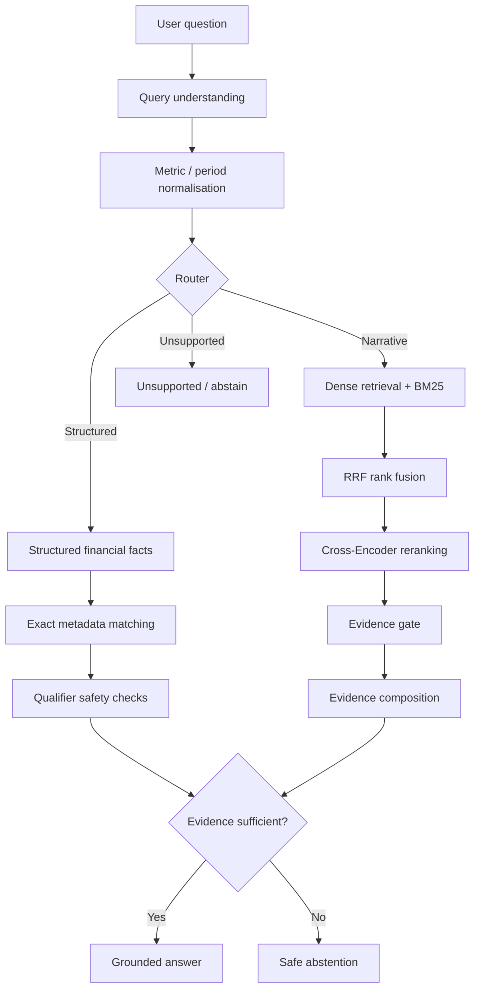

# Financial RAG — Evidence-Grounded Financial Document QA

A portfolio-scale **financial document intelligence system** for answering questions from corporate earnings materials with explicit evidence, deterministic financial fact retrieval, hybrid narrative retrieval, and safe abstention when the available evidence is insufficient.

This showcase is built around **Meta Platforms' Q2 2026 earnings materials** and is designed to demonstrate the architecture and reliability principles behind a domain-specific Financial RAG system rather than to act as a general-purpose financial assistant.

## Why this project

A conventional RAG pipeline can retrieve text that is relevant to a question but still fail to prove the requested financial claim. In financial documents, small semantic differences matter:

- company-wide revenue vs. segment revenue,
- quarterly values vs. year-to-date values,
- historical actuals vs. management guidance,
- currency values vs. percentages,
- relevant evidence vs. evidence that is actually sufficient.

The project therefore treats retrieval as only one stage of the pipeline. Its main design goal is:

> **Do not answer beyond the available evidence.**

## System architecture



The repository contains two complementary retrieval paths.

### 1. Structured financial fact retrieval

Questions asking for exact historical financial facts are routed to a structured fact store. The system normalises finance-specific aliases and matches facts using metadata such as:

- company,
- canonical financial metric,
- reporting period,
- unit,
- page and source provenance.

Example:

```text
Question: What was Meta's operating profit in Q2 2026?

Alias normalisation:
operating profit -> Income from operations

Retrieved fact:
Value: 18,775
Unit: USD millions
Period: Three Months Ended June 30, 2026
Source page: 1
```

This path is deterministic and avoids asking an LLM to reconstruct numbers that already exist as structured facts.

### 2. Hybrid narrative retrieval

Explanation, guidance, and narrative questions use a hybrid retrieval pipeline:

```text
Dense retrieval
    +
BM25 lexical retrieval
    ↓
Reciprocal Rank Fusion (RRF)
    ↓
Cross-Encoder reranking
    ↓
Top evidence candidates
    ↓
Evidence validation
    ↓
Evidence composition
    ↓
Grounded generation
```

The current implementation uses:

- `sentence-transformers/all-MiniLM-L6-v2` for dense embeddings,
- `bm25s` for lexical retrieval,
- Reciprocal Rank Fusion for rank aggregation,
- `cross-encoder/ms-marco-MiniLM-L6-v2` for reranking.

The LLM is only called after upstream evidence checks determine that the evidence is answerable.

## Reliability features

### Finance-domain metric normalisation

A shared financial metric registry maps common aliases to canonical concepts, for example:

```text
operating profit
operating income
income from operations
        ↓
operating_income
```

### Qualifier safety

The system is designed to avoid silently dropping unresolved qualifiers. For example, a question about a non-existent `cloud revenue` metric should not collapse into total company revenue simply because the words `revenue` and `Meta` are present.

### Explicit provenance

Structured facts carry source metadata such as page, company, reporting period, and document name so retrieved answers can be traced back to their supporting evidence.

### Safe abstention

When the requested fact is outside the document scope or the available evidence is insufficient, the system can return states such as:

```text
INSUFFICIENT
UNSUPPORTED
AMBIGUOUS
```

rather than fabricating an answer.

## Example questions

The included showcase covers examples such as:

```text
What was Meta's revenue in Q2 2026?
What was Meta's operating income in Q2 2026?
What was Meta's operating margin in Q2 2026?
What was Meta's capital expenditure in Q2 2026?
What was Meta's cloud revenue in Q2 2026?
What is Meta's stock price target?
```

The first four are expected to retrieve evidence-backed structured facts. The last two test abstention and out-of-scope handling.

## Portfolio benchmark

The repository includes a **50-case curated financial QA benchmark** consisting of:

- 25 cases drawn from the development benchmark, and
- 25 cases drawn from a broader evaluation set.

It is intentionally described as a **curated portfolio benchmark, not a held-out generalisation test**.

| Metric | Result |
|---|---:|
| Pipeline Completion | 50/50 (100.0%) |
| Route Accuracy | 40/50 (80.0%) |
| Status / Behaviour | 36/50 (72.0%) |
| Strict Case Accuracy | 31/50 (62.0%) |
| Structured Numeric | 18/28 (64.3%) |
| Unit Accuracy | 21/28 (75.0%) |
| Evidence Provenance | 21/28 (75.0%) |
| Safe Abstention | 14/15 (93.3%) |
| Narrative Content | 0/3 (0.0%) |

Two metrics are especially relevant to the reliability objective of this showcase:

- **80.0% routing accuracy**
- **93.3% safe-abstention accuracy**

Full case-level results are available in:

```text
evaluation/benchmark_50_portfolio_results.md
```

## Repository structure

```text
financial-rag-showcase/
├── data/
│   ├── meta_q2_2026_chunks.json
│   └── meta_q2_2026_financial_facts.json
│
├── evaluation/
│   ├── benchmark_50_portfolio.json
│   ├── run_benchmark_50_portfolio.py
│   ├── benchmark_50_portfolio_results.json
│   └── benchmark_50_portfolio_results.md
│
├── showcase/
│   └── demo.py
│
├── src/financial_rag/
│   ├── generation/
│   │   ├── evidence_composer.py
│   │   ├── evidence_gate.py
│   │   ├── generator.py
│   │   └── llm_client.py
│   │
│   ├── ingestion/
│   ├── query_understanding/
│   ├── retrieval/
│   ├── main.py
│   └── domain_rules.py
│
├── .env.example
├── requirements.txt
└── README.md
```

## Quick start

### 1. Clone the repository

```bash
git clone <YOUR_GITHUB_REPOSITORY_URL>
cd financial-rag-showcase
```

### 2. Create a virtual environment

```bash
python -m venv .venv
source .venv/bin/activate
```

### 3. Install dependencies

```bash
pip install -r requirements.txt
```

### 4. Run the showcase

```bash
PYTHONPATH=src python showcase/demo.py
```

The structured retrieval and abstention examples do not require an LLM API call.

## Optional LLM configuration

Narrative generation uses an OpenAI-compatible client. Copy the included example file and fill in your provider settings if you want to enable that path:

```bash
cp .env.example .env
```

```text
LLM_API_KEY=your_api_key
LLM_BASE_URL=your_provider_base_url
LLM_MODEL=your_model_name
```

The `.env` file is excluded from version control and should never be committed.

The narrative path is deliberately downstream of evidence validation: the LLM does not decide whether the evidence is sufficient.

## Run the benchmark

```bash
PYTHONPATH=src python evaluation/run_benchmark_50_portfolio.py
```

The runner evaluates routing, behaviour, structured numeric accuracy, units, evidence provenance, safe abstention, and narrative cases.

Narrative benchmark cases require a configured LLM endpoint. Without one, structured retrieval and abstention cases still run, while narrative cases may report an LLM service failure.

## Current limitations

This repository is a **portfolio showcase**, not a production financial research platform.

Current limitations include:

- the showcase is centred on one company and one reporting package;
- the 50-case benchmark is curated and should not be interpreted as a held-out generalisation result;
- narrative answering is currently the weakest part of the benchmark;
- segment-aware structured retrieval remains incomplete;
- deterministic finance-domain rules are used for selected aliases, qualifier safety, and structured fallbacks;
- the system does not provide live market prices, investment recommendations, or external market data;
- this repository focuses on the QA/retrieval layer rather than a full production ingestion service.

## Design direction

The broader research direction is **reliability-first financial document intelligence**. The next areas of development are:

1. stronger segment and qualifier handling;
2. stock-vs-flow and period semantics;
3. broader table and cross-page document understanding;
4. stronger narrative evidence sufficiency checks;
5. multi-document retrieval;
6. auditable numerical reasoning built on verified financial facts;
7. evaluation against stronger held-out and external baselines.

## Project status

This repository is a frozen showcase version intended to present the core architecture, evaluation framework, and reliability-oriented design choices. Ongoing research and experimental work are maintained separately.

---

**Scope note:** this project is an engineering/research portfolio demonstration. It is not investment advice and does not provide live market information.
